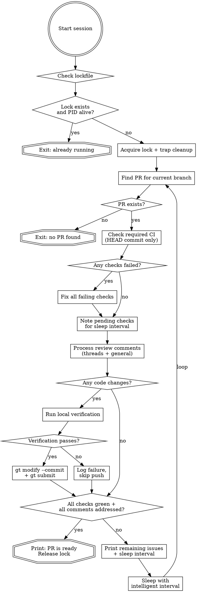

# Babysit PR

Autonomously monitor a PR, fix CI failures, respond to review comments, and push verified fixes. Runs as a **long-running session** — loops internally with intelligent sleep intervals until the PR is ready or the user stops the session.

## Invocation

```
/babysit-pr
```

## Session Loop

The skill runs in a continuous loop:

1. Check PR status (CI + reviews)
2. Fix issues if any
3. If PR is ready → print success and exit
4. Otherwise → sleep for an intelligent interval, then repeat



### 1. Concurrency Guard

Run `lockguard.sh acquire` (in this skill's directory). If it exits non-zero, another session is running — exit immediately. The script handles PID-based stale lock detection and sets a trap to clean up on exit.

### 2. Find PR

```bash
gh pr view --json number,url,headRefOid
```

If no PR exists for the current branch, print an error and exit.

### 3. Check Required CI

```bash
gh pr checks --json name,state,bucket,link,required
```

- Only act on checks for the **HEAD commit** — verify via `headRefOid` from step 2.
- **Fix failures immediately** — don't wait for all checks to finish. If some checks have already failed while others are still pending, fix the failed ones right away. The push will trigger a fresh CI run for everything anyway.
- For each **failing** check (required and optional):
  1. Get logs: `gh run view <run-id> --log-failed`
  2. Investigate the root cause
  3. Fix the code
- If checks are `pending` or `in_progress`, note how long they've been running (use `gh run view <run-id> --json createdAt`) to inform sleep interval.
- Optional check failures are best-effort — fix them if possible, but they do not block the exit condition.

### 4. Process Review Comments

Fetch **both** review threads (inline comments) **and** general review comments (top-level review bodies not tied to specific lines).

#### 4a. Inline Review Threads

```bash
gh api graphql -f query='
  query($owner: String!, $repo: String!, $pr: Int!) {
    repository(owner: $owner, name: $repo) {
      pullRequest(number: $pr) {
        reviewThreads(first: 100) {
          nodes {
            id
            isResolved
            comments(first: 10) {
              nodes { body author { login } path line }
            }
          }
        }
      }
    }
  }
'
```

#### 4b. General Review Comments

These are top-level review comments — the body text of a review submission, not tied to any specific file or line. They often contain important high-level feedback, architectural concerns, or summary requests.

```bash
gh api repos/{owner}/{repo}/pulls/{pr}/reviews --jq '.[] | select(.body != "" and .body != null) | {id, body, state, user: .user.login}'
```

Also fetch standalone PR comments (conversation tab, not part of a review):

```bash
gh api repos/{owner}/{repo}/issues/{pr}/comments --jq '.[] | {id, body, user: .user.login}'
```

#### Processing Rules

**Skip** any thread/comment that:
- Is resolved (for threads)
- Has already been addressed by the babysitter (last reply is from the bot / starts with 🤖)

**Classify and act on each remaining thread or comment.**

**All replies MUST start with 🤖 to identify as AI-assisted.**

| Type | Signals | Action |
|------|---------|--------|
| Real issue | Bug, correctness problem, missing edge case, security concern | Fix code. Reply: "🤖 Fixed — [description of change]". Resolve thread (if applicable). |
| Scope change | Feature request, style preference, behavioral change | Reply: "🤖 This is outside the scope of this PR. [brief explanation]". Leave open. |
| Non-issue | Misunderstanding, already handled, factually incorrect | Reply: "🤖 [explanation of why this isn't an issue]". Leave open. |

For general review comments, reply using the appropriate API:
- Review comments: `gh api repos/{owner}/{repo}/pulls/{pr}/reviews/{review_id}/comments` or reply to the review
- Issue comments: `gh api repos/{owner}/{repo}/issues/{pr}/comments -f body="..."`

### 5. Verify and Push

If any code changes were made:

1. **Run local verification** — test, lint, typecheck commands per the project's CLAUDE.md/AGENTS.md
2. **If passing:** commit and push using `working-with-graphite` skill:
   - `gt modify --commit` (amends onto existing branch)
   - `gt submit`
3. **If failing:** Do not push. Log the failure — next loop iteration will retry.

### 6. Sleep Interval Logic

After each iteration, choose a sleep duration based on current state:

| Situation | Sleep Duration | Rationale |
|-----------|---------------|-----------|
| Just pushed new code, CI not started yet | **2 minutes** | CI needs time to pick up the new commit |
| Some checks failed (already fixed & pushed), others still running | **3 minutes** | Fresh push will re-run everything, check back soon |
| All checks still running, started < 5 min ago | **3 minutes** | Checks are fresh, check back soon |
| All checks still running, started 5-15 min ago | **5 minutes** | Give checks time to complete |
| All checks still running, started > 15 min ago | **5 minutes** | Long-running checks, keep polling steadily |
| All CI green, waiting on reviewer | **10 minutes** | Human response times are slower |
| No actionable items but PR not fully ready | **5 minutes** | Default polling interval |

Print the chosen interval and reason before sleeping: `"Sleeping {N} minutes — {reason}"`

Use shell `sleep` for the wait (e.g., `sleep 300` for 5 minutes).

### 7. Exit Condition

The PR is ready when:
- All **required** CI checks are passing on HEAD
- All review threads are either resolved OR have a babysitter reply as the last comment
- All general review comments have been addressed (babysitter reply exists)

Optional check failures do **not** block this exit condition. If optional checks are still failing when the exit condition is met, note them in the output but still declare the PR ready.

Print: **"All required checks passing and all review comments addressed. PR is ready."**

Release the lock and exit.

## Common Mistakes

- **Acting on stale CI results** — Always verify checks are for the HEAD commit before investigating failures. If checks are pending, wait.
- **Replying to the same comment twice** — Check if the last reply in a thread is already from the babysitter before responding.
- **Pushing without local verification** — Always run the project's verification commands before `gt modify --commit`.
- **Resolving threads you shouldn't** — Only resolve threads where you fixed a real issue. Leave scope-change and non-issue threads open for the reviewer.
- **Missing general review comments** — Don't only check inline threads. Always also fetch top-level review bodies and issue comments — reviewers often put their most important feedback there.
- **Sleeping too long after pushing** — After pushing a fix, use a short interval so you catch CI results quickly.
