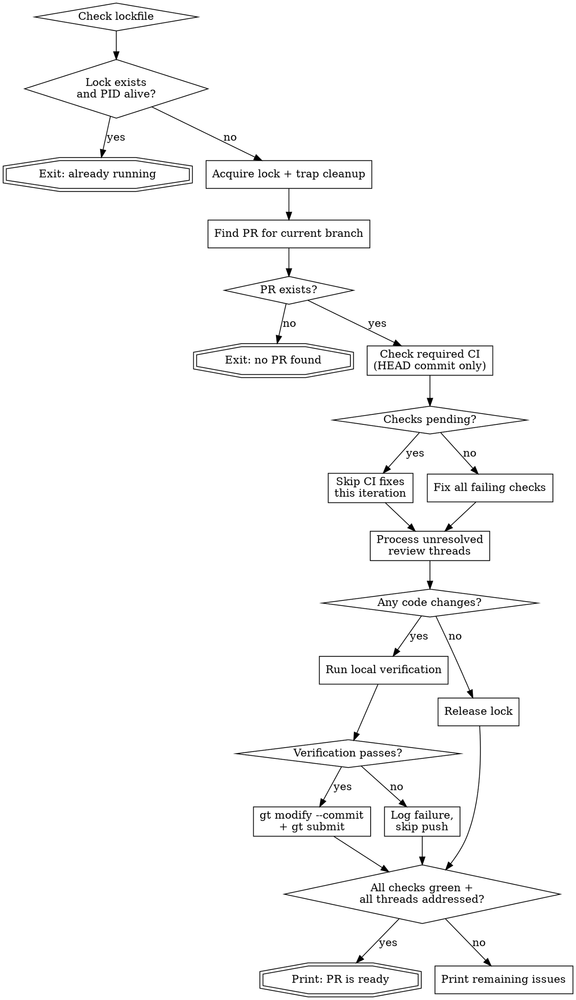

# Babysit PR

Autonomously monitor a PR, fix CI failures, respond to review comments, and push verified fixes. Designed for `/loop 5m /babysit-pr` — each invocation is stateless.

## Invocation

```bash
/loop 5m /babysit-pr
```

## Iteration Flow



### 1. Concurrency Guard

Run `lockguard.sh acquire` (in this skill's directory). If it exits non-zero, another iteration is running — exit immediately. The script handles PID-based stale lock detection and sets a trap to clean up on exit.

### 2. Find PR

```bash
gh pr view --json number,url,headRefOid
```

If no PR exists for the current branch, print an error and exit.

### 3. Check Required CI

```bash
gh pr checks --json name,state,bucket,link,required
```

- Only act on checks for the **HEAD commit** — verify via `headRefOid` from step 2.
- If any checks are `pending` or `in_progress`, skip CI fixes this iteration.
- For each **failing** check (required and optional):
  1. Get logs: `gh run view <run-id> --log-failed`
  2. Investigate the root cause
  3. Fix the code
- Optional check failures are best-effort — fix them if possible, but they do not block the exit condition.

### 4. Process Review Comments

Query unresolved review threads:

```bash
gh api graphql -f query='
  query($owner: String!, $repo: String!, $pr: Int!) {
    repository(owner: $owner, name: $repo) {
      pullRequest(number: $pr) {
        reviewThreads(first: 100) {
          nodes {
            id
            isResolved
            comments(first: 10) {
              nodes { body author { login } }
            }
          }
        }
      }
    }
  }
'
```

**Skip** any thread that is resolved or where the last comment is from the babysitter (already addressed).

**Classify and act on each remaining thread.**

**All replies MUST start with 🤖 to identify as AI-assisted.**

| Type | Signals | Action |
|------|---------|--------|
| Real issue | Bug, correctness problem, missing edge case, security concern | Fix code. Reply: "🤖 Fixed — [description of change]". Resolve thread. |
| Scope change | Feature request, style preference, behavioral change | Reply: "🤖 This is outside the scope of this PR. [brief explanation]". Leave thread open. |
| Non-issue | Misunderstanding, already handled, factually incorrect | Reply: "🤖 [explanation of why this isn't an issue]". Leave thread open. |

### 5. Verify and Push

If any code changes were made:

1. **Run local verification** — test, lint, typecheck commands per the project's CLAUDE.md/AGENTS.md
2. **If passing:** commit and push using `working-with-graphite` skill:
   - `gt modify --commit` (amends onto existing branch)
   - `gt submit`
3. **If failing:** Do not push. Log the failure — next iteration will retry.

### 6. Exit Condition

The PR is ready when:
- All **required** CI checks are passing on HEAD
- All review threads are either resolved OR have a babysitter reply as the last comment

Optional check failures do **not** block this exit condition. If optional checks are still failing when the exit condition is met, note them in the output but still declare the PR ready.

Print: **"All required checks passing and all review comments addressed. PR is ready — you can stop the loop."**

Otherwise, print a summary of remaining issues.

## Common Mistakes

- **Acting on stale CI results** — Always verify checks are for the HEAD commit before investigating failures. If checks are pending, wait.
- **Replying to the same comment twice** — Check if the last reply in a thread is already from the babysitter before responding.
- **Pushing without local verification** — Always run the project's verification commands before `gt modify --commit`.
- **Resolving threads you shouldn't** — Only resolve threads where you fixed a real issue. Leave scope-change and non-issue threads open for the reviewer.
